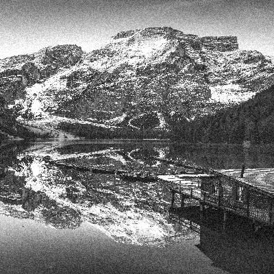

## 2. Görevlendirme

Opencv kütüphanesini kullanarak bir görüntüyü içe aktarma, yeniden boyutlandırma, gri tonlama, histogram eşitleme ve gürültü ekleme gibi işlemlerin yapılması.

---

Orjinal Image

Resized Image

Gray Image

Equalized Image

Noisy Image

